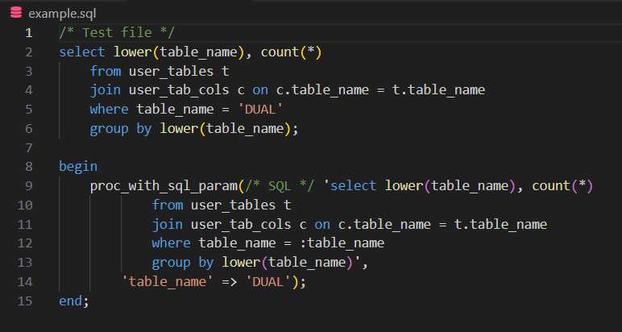

# sql-string-injector

VS Code extension to add SQL syntax highlighting inside string literals containing SQL, identified by the `/* SQL */` prefix.

## Main Feature

This extension detects string literals in your code that start with the `/* SQL */` prefix and automatically applies SQL syntax highlighting to their content. This makes SQL queries more readable and easier to edit directly within your source code.

## Example



```SQL
select lower(table_name), count(*) 
    from user_tables t
    join user_tab_cols c on c.table_name = t.table_name
    where table_name = 'DUAL'
    group by lower(table_name);

begin
    proc_with_sql_param(/* SQL */ 'select lower(table_name), count(*) 
        from user_tables t
        join user_tab_cols c on c.table_name = t.table_name
        where table_name = :table_name
        group by lower(table_name)',
    'table_name' => 'DUAL');
end;
/
```

In this example, the SQL queries will be highlighted as if they were in a regular `.sql` file.

## Extension Settings

This extension contributes the following settings:

* `sql-string-injector.enable`: Enable/disable this extension.
* `sql-string-injector.thing`: Set to `blah` to do something.

**Enjoy!**
